# 1. Запустить nginx на нестандартном порту 3-мя разными способами:
* переключатели setsebool;
* добавление нестандартного порта в имеющийся тип;
* формирование и установка модуля SELinux.

  
Запускаем nginx на порту 5080 без изменений в политиках selinux

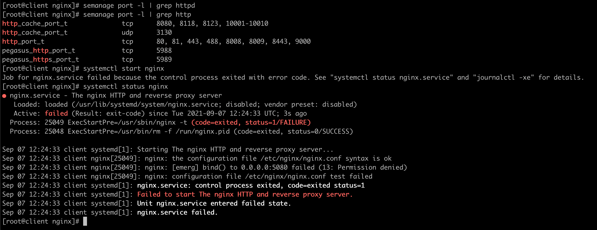

  
Посмотрим на вывод sealert.

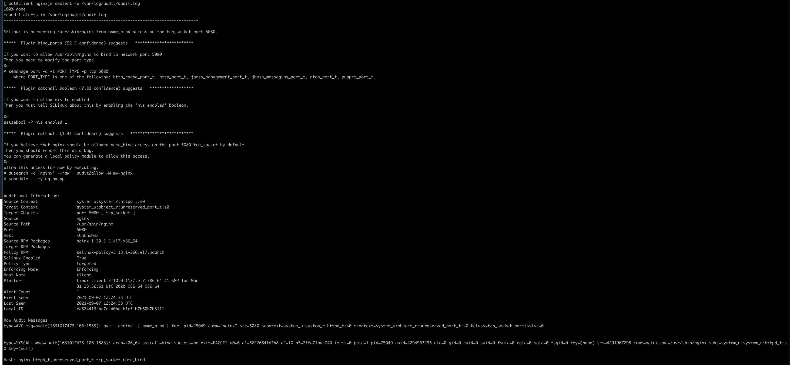

## Переключатели setsebool

  
Sealert сообщает, что переключатель, которым можно достичь желаемого - nis_enabled

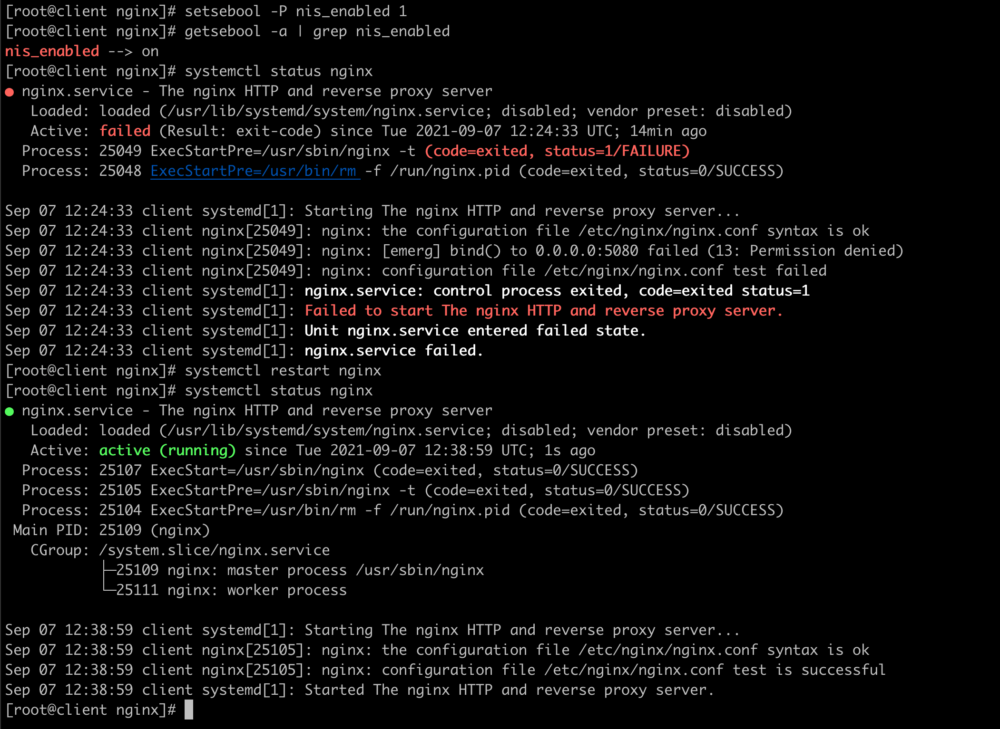

## Добавление нестандартного порта в имеющийся тип

  
Добавим порт 5080 в пул http_port_t

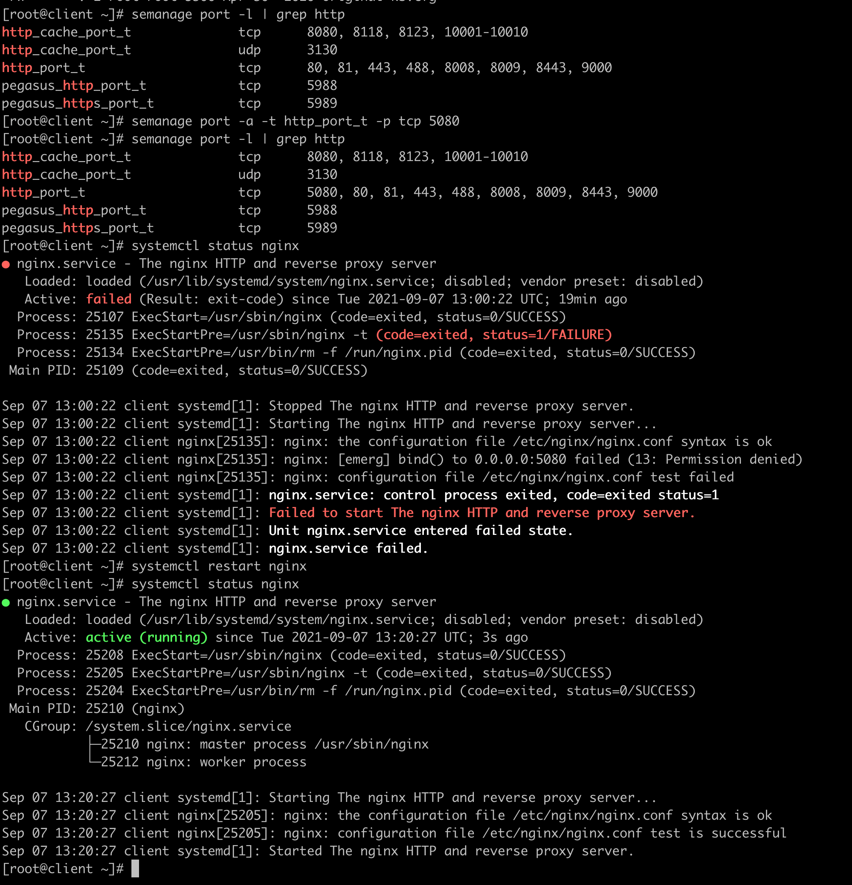

## Формирование и установка модуля SELinux

  
Сформируем и установим модуль по рекомендации утилиты sealert

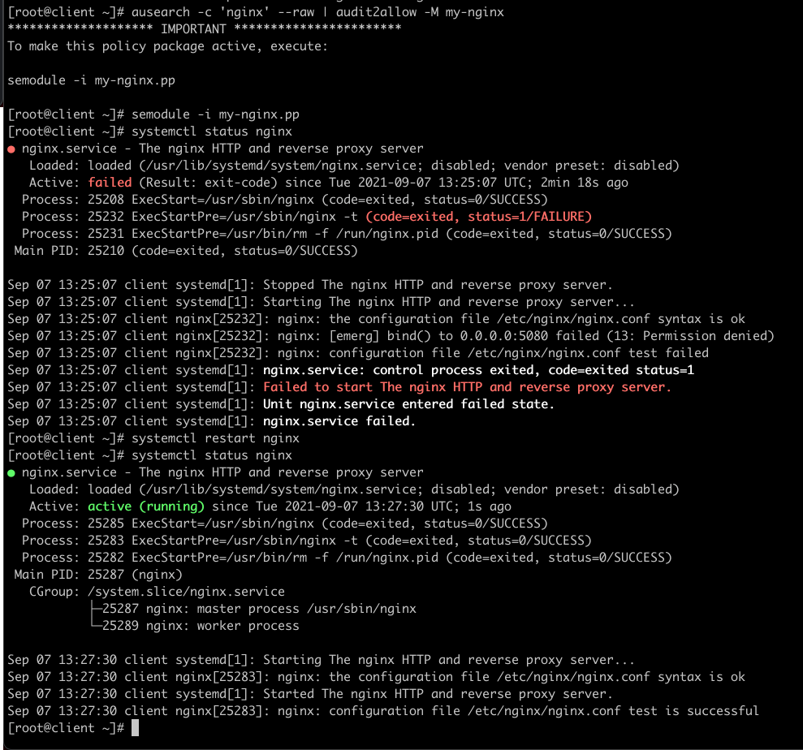

# 2. Выяснить причину неработоспособности механизма обновления зоны

  
Для начала убедимся, что dns сервер ничего не знает о записи www.ddns.lab:

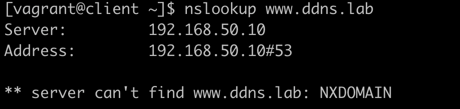

  
Попробуем добавить запись в динамическую зону:

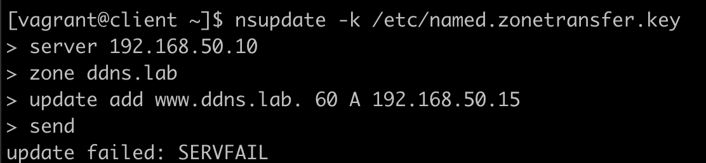

Получаем ошибку, переходим к серверу ns01, и проверяем сообщения в файле /var/log/audit/audit.log, где находим примерно следующее:

    type=AVC msg=audit(1630934614.498:1925): avc:  denied  { create } for  pid=5072 comm="isc-worker0000" name="named.ddns.lab.view1.jnl" scontext=system_u:system_r:named_t:s0 tcontext=system_u:object_r:etc_t:s0 tclass=file permissive=0
    type=SYSCALL msg=audit(1630934614.498:1925): arch=c000003e syscall=2 success=no exit=-13 a0=7fa5e19ca050 a1=241 a2=1b6 a3=24 items=0 ppid=1 pid=5072 auid=4294967295 uid=25 gid=25 euid=25 suid=25 fsuid=25 egid=25 sgid=25 fsgid=25 tty=(none) ses=4294967295 comm="isc-worker0000" exe="/usr/sbin/named" subj=system_u:system_r:named_t:s0 key=(null)
    type=PROCTITLE msg=audit(1630934614.498:1925): proctitle=2F7573722F7362696E2F6E616D6564002D75006E616D6564002D63002F6574632F6E616D65642E636F6E66

Видим, что сервис named пытается создать файл, но из-за политик selinux не может этого сделать в директории /etc/named/dynamic/.

  
Гуглим... В основном, все советы крутятся вокруг boolean переключателя named_write_master_zones. Проверяем и видим, что параметр на сервере включен:

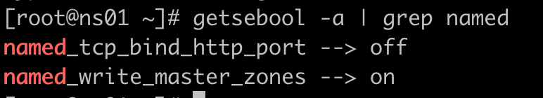

  
Посмотрим, какие решения предложит sealert:

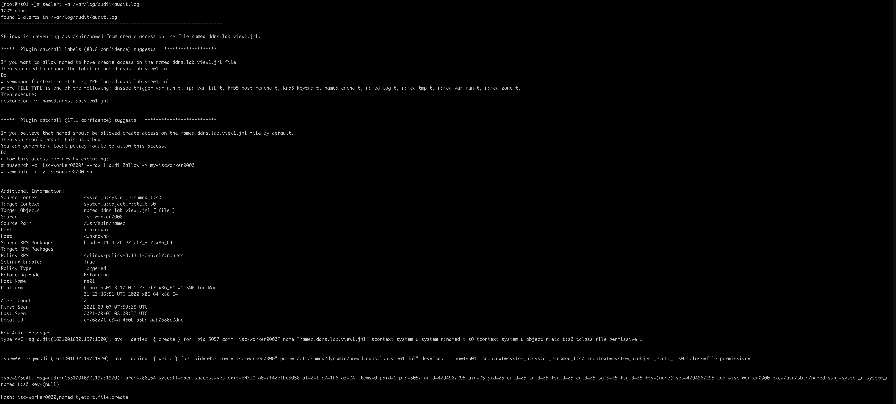

* Добавить file_context для целевого файла "named.ddns.lab.view1.jnl" с применением к нему "правильного" типа;
* Создать модуль, разрешающий процессу с типом named_t создавать и записывать файлы с типом etc_t.

Попробуем реализовать первый вариант, т.к. с ним мы можем ограничить возможности процесса named на создание и запись файлов по какому-то конкретному пути в фс.

  
Нужно выяснить, какой именно тип объекта нам нужен для добавления в fcontext. Для этого воспользуемся утилитой sesearch отфильтровавшись по named_write_master_zones, т.к. он явно указывает на запись зон:

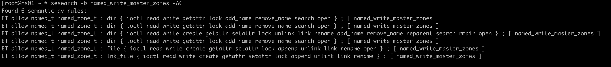

  
Пробуем fcontext named_zone_t. Но не по имени файла, как предлагает это делать sealert, а всю директорию динамических зон:

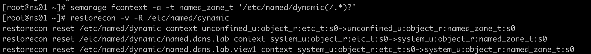

  
Снова пробуем добавить запись в динамическую зону:

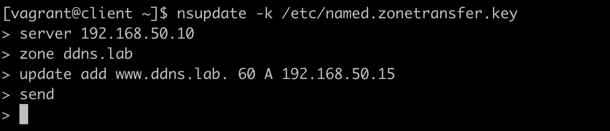

  
На этот раз все проходит без ошибок. Проверяем доступность днс-записи:

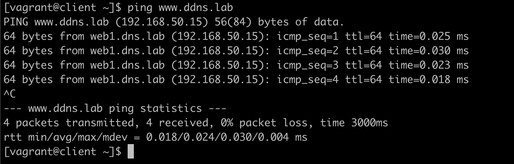

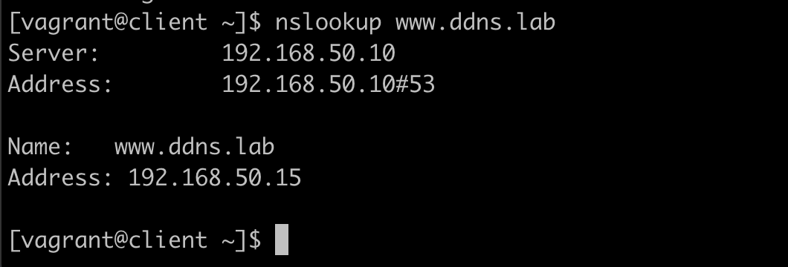

Profit!
